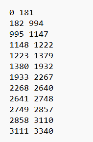

# Description

In this project we use keyframe extraction  for video summarization.we present a large model based sequential keyframe extraction, dubbed LMSKE, to extract minimal keyframes to sum up a given video with their sequences maintained. 

First, The large model TransNetV2 was utilized to conduct shot segmentations, and the large model CLIP was employed to extract semantic features for each frame within each shot. Second, an adaptive clustering method is devised to automatically determine the optimal clusters, based on which we performed candidate keyframe selection and redundancy elimination shot by shot. Finally, a keyframe set was obtained by concatenating keyframes of all shots in chronological order.

The file for this project consists of the following：

 

The [extraction folder](/src/extraction) contains our code for extracting keyframes, and the [scripts  folder](/src/scripts) folder contains the script files for saving keyframes and evaluating the extraction performance.

# Method
## Shot segmentations
We use the large model TransNetV2 for segmentation. Code from https://github.com/soCzech/TransNetV2. By this step, we will get the shot segmentation result of the video and the result will be saved locally in txt form. The front indicates the start frame of the shot and the back indicates the end frame of the shot.

 
## Feature Extraction
We use the large-scale model CLIP to extract semantic features for each frame in each shot. Code from https://www.modelscope.cn/models/damo/multi-modal_clip-vit-large-patch14_336_zh/summary. 

The video is subjected to feature extraction through the CLIP large model to obtain a 768-dimensional feature vector for each frame of the video. We save the features of the whole video locally in the form of .pkl for subsequent use.
## Clustering
We designed an adaptive clustering method to automatically determine the best clustering results. The code can be found in our repository. [Keyframe_extraction.py](src/extraction/Keyframe_extraction.py) 

We take the video feature file（features_path） and the lens segmentation result （scenes_path）file as inputs and after running them we get best_clusters, best_centers, best_k,centre_indices 
## Redundancy
After obtaining the clustering results, we perform shot-by-shot selection and redundancy elimination of candidate keyframes. In terms of de-redundancy, we mainly divide it into two aspects, on the one hand, it is for solid colour frames or low information frames, and on the other hand, it is for frames with a high degree of similarity. The code can be found in our repository. [Redundancy.py](src/extraction/Redundancy.py)  After running it to get the final keyframe sequence

# Evaluation
## Benchmark dataset
The dataset we use is a benchmark dataset we built ourselves called TvSum20, which is used to evaluate the performance of the keyframe extraction method. Dataset from https://github.com/ttharden/Keyframe-extraction
## Scripts
We use a script to evaluate the extracted keyframes. The code can be found in our repository. [Evaluation.py](src/extraction/Evaluation.py)  

We take the key frame sequences extracted by the method(test_index) and the sequences of the benchmark dataset(keyframe_center) as inputs and output the corresponding performance metrics values, which include F-value, fidelity, and compression ratio.

# Case
This is a case of keyframe extraction by our proposed method. Below are examples of keyframe sequences extracted by different methods:

 

# Use it 
_Step 1:_ Run TransNetV2 to get the result of shot segmentation

_Step 2:_ Run CLIP to get the features of the video frame

_Step 3:_ Run Keyframe_extraction.py to get the keyframe sequence

_Step 4:_ Run save_keyframe.py to save the keyframes and Evaluation.py for proper evaluation

# Reference
Tomas Soucek and Jakub Lokoc, “Transnet V2: an effective deep network architecture for fast shot transition detection,” arXiv:2008.04838, pp. 1–4, 2020.

Yang, An and Pan, Junshu and Lin, Junyang and Men, Rui and Zhang, Yichang and Zhou, Jingren and Zhou, Chang, "Chinese CLIP: Contrastive Vision-Language Pretraining in Chinese" arXiv preprint arXiv:2211.01335,2022

