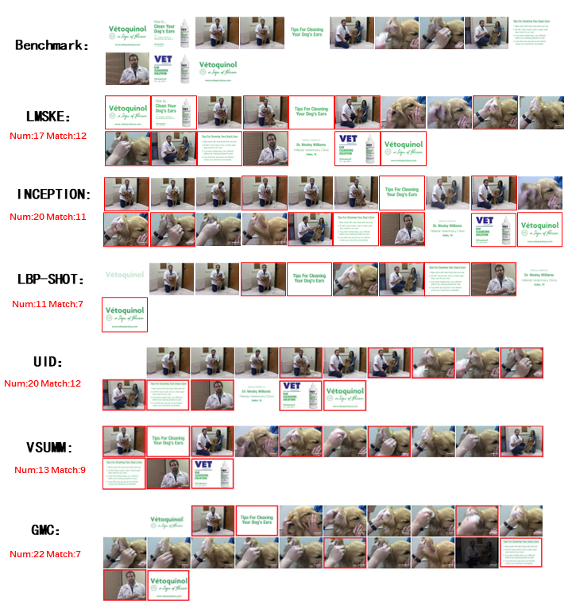

# Description

In this project we use keyframe extraction skimming for video summarization.

we present a large model based sequential keyframe extraction, dubbed LMSKE, to extract minimal keyframes to sum up a given video with their sequences maintained. First, The large model TransNetV2 [11] was utilized to conduct shot segmentations, and the large model CLIP was employed to extract semantic features for each frame within each shot.Second, an adaptive clustering method is devised to automatically determine the optimal clusters, based on which we performed candidate keyframe selection and redundancy elimination shot by shot. Finally, a keyframe set was obtained by concatenating keyframes of all shots in chronological order.

# Method
## Shot segmentations
We use the large model TransNetV2 for segmentation. Code from https://github.com/soCzech/TransNetV2
## Feature Extraction
We use the large-scale model CLIP to extract semantic features for each frame in each shot. Code from https://www.modelscope.cn/models/damo/multi-modal_clip-vit-large-patch14_336_zh/summary
## Clustering
We designed an adaptive clustering method to automatically determine the best clustering results. The code can be found in our repository.
## Redundancy
After obtaining the clustering results, we perform shot-by-shot selection and redundancy elimination of candidate keyframes. In terms of de-redundancy, we mainly divide it into two aspects, on the one hand, it is for solid colour frames or low information frames, and on the other hand, it is for frames with a high degree of similarity. The code can be found in our repository.

# Evaluation
## benchmark dataset
The dataset we use is a benchmark dataset we built ourselves called TvSum20, which is used to evaluate the performance of the keyframe extraction method. Dataset from https://github.com/ttharden/Keyframe-extraction
## scripts
We use a script to evaluate the extracted keyframes.The code can be found in our repository

# Case
This is a case of keyframe extraction by our proposed method.Below are examples of keyframe sequences extracted by different methods：
